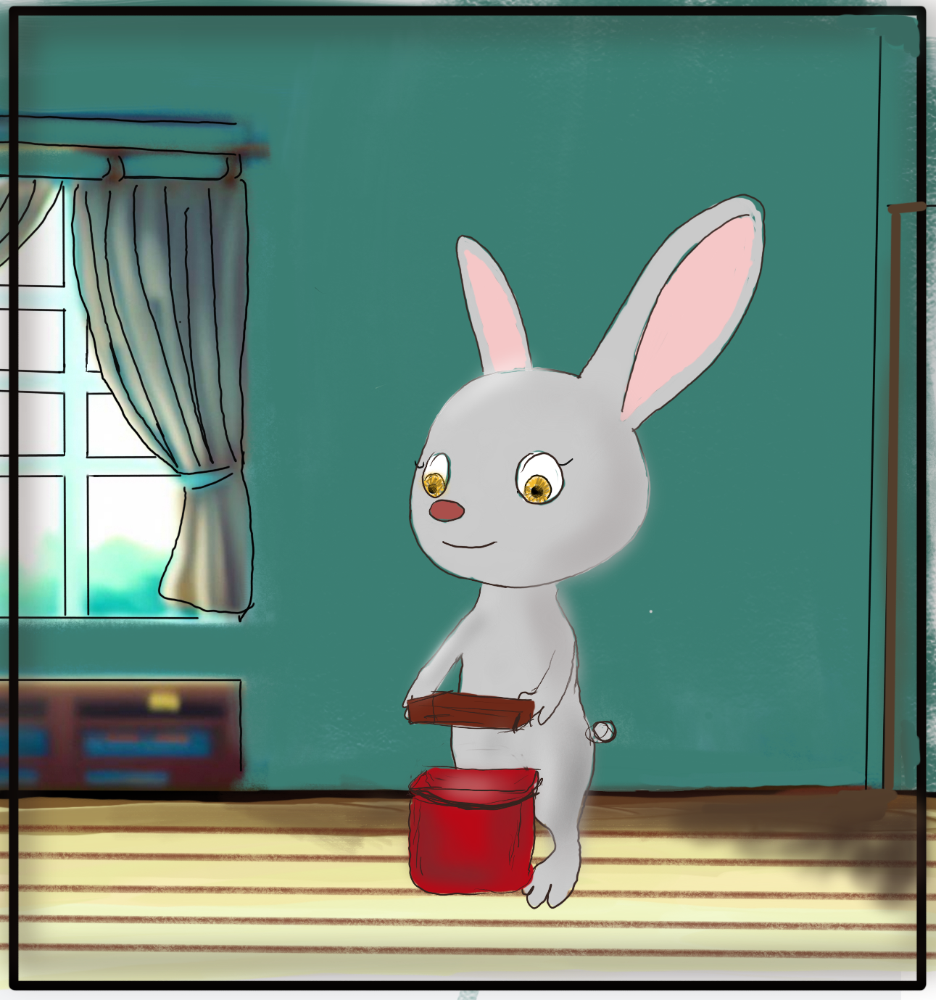

# Takım İsmi
Unity-129

# Takım Rolleri
Sena DEMİRBAŞ - Scrum Master

Muhammed Ruşan GÜVENÇ - Product Owner

Ekin Ezgi YILDIZHAN - Developer

Furkan Tunç SÖĞÜT - Developer

Nur Bahar YAVUZ - Developer

# Ürün İsmi
Live For Life

# Ürün Açıklaması
Hayvanların kozmetik ürün deneylerinde kullanılmasına tepki amaçlı tasarlanan oyunun ana karakteri olan tavşanımız, iyi amaçlarla geldiğini düşündüğü laboratuvar ortamında eski deneklere ait bazı eşyalar ve notlar bularak buranın aslında kötü bir yer olduğunun farkına varır. Laboratuvar ortamından kaçmaya çalışmasıyla oyun başlar. Oyunun amacı tavşanın laboratuvar ortamından, üzerinde uygulanacak deneylerden kaçıp doğal ortamına ulaşmasını sağlamaktır.

# Ürün Özellikleri

Soft 3d enviroment elements

Cinematics

Secret mission system

Puzzles

2 different theme (dark and soft – happy and scared)

# Hedef Kitle
+13 yaş kitlesi

Hayvansever insanlar

# Sprint 1

Sprint Notları: User Story'ler ve puanları product backlog'ların içine yazılmıştır. Product backlog item'lara tıklandığında hikayelerin detayları okunabilir.

Sprint içinde tamamlanması tahmin edilen puan: 100 Puan

Puan tamamlama mantığı: Toplamda proje boyunca tamamlanması gereken 450 puanlık backlog bulunmaktadır. 3 sprint'e bölündüğünde ilk sprint'in en azından 100 ile başlaması gerektiğine karar verildi.

Daily Scrum: Daily Scrum toplantılarının Whatsapp ve Discord  üzerinden yapılmasına karar verilmiştir. [Daily_Scrum.docx](https://github.com/senademirbass/Unity-129/blob/main/Daily_Scrum.docx)

Sprint Board Not: Grafiklere gösterge panosundan ulaşılmaktadır.

Sprint board update: Sprint board screenshotları: 

Ürün Durumu: Ekran görüntüleri: 

Sprint Review: Alınan kararlar: Oyun hikayesi ve amacı netleştirildi. Kullanılacak assetler kaba taslak olarak belirlendi.Genel kontroller ve kamera takip kodları yapıldı. Animasyonlar üzerine çalışılıyor. Sahne tasarımları çizildi ve sinematik geçişler için tasarımlar devam ediyor. Bazı bulmaca mekanikleri ayarlandı. Sprint Review Katılımcıları : Tüm üyeler katılmıştır.

Sprint Retrospective: 

1.Tahmin puanlamaları gözden geçirilmeli.

2.Github reposunu güncellemek için .git kullanımına yoğunlaşılmalı.

# Product Backlog

[U-129 Product Backlog Trello Board](https://trello.com/b/riyQvt6m/u-129)

# Sprint 2

Sprint Notları: User Story'ler ve puanları product backlog'ların içine yazılmıştır. Product backlog item'lara tıklandığında hikayelerin detayları okunabilir.

Sprint içinde tamamlanması tahmin edilen puan: 150 Puan

Daily Scrum: Daily Scrum toplantılarının Whatsapp ve Discord  üzerinden yapılmasına karar verilmiştir. [Daily_Scrum_2.docx](https://github.com/senademirbass/Unity-129/blob/main/Daily_Scrum_Sprint_2.docx)

Sprint Board Not: Premium süresi dolduğu için grafikler screenshot olarak eklendi.

Sprint board update: Sprint board screenshotları: 

Ürün Durumu: Ekran görüntüleri: 

Sprint Review: Alınan kararlar: Belirlenen sahne tasarımları yapıldı ve karakter asseti tasarlandı. Karakter animasyonları üzerine çalışıldı. Başlangıç sahnesinin sinematik çizimlerine devam edildi ve eksikler değerlendirildi. Sprint Review Katılımcıları : Tüm üyeler katılmıştır.

Sprint Retrospective: 

1. Ekip üyelerinden birinin teknik arıza yaşaması sebebiyle 2.sprintte yapılamayan ve sarkan görevlere 3.sprintte yoğunlaşılmalı.

# Product Backlog

[U-129 Product Backlog Trello Board](https://trello.com/b/wWiXLAKF/2-sprint)

# Sprint 3

Sprint Notları: User Story'ler ve puanları product backlog'ların içine yazılmıştır. Product backlog item'lara tıklandığında hikayelerin detayları okunabilir.

Sprint içinde tamamlanması tahmin edilen puan: 200 puan

Daily Scrum: Daily Scrum toplantılarının Whatsapp ve Discord üzerinden yapılmasına karar verilmiştir.
[Daily_Scrum_Sprint_3 (1).docx](https://github.com/senademirbass/Unity-129/files/12065641/Daily_Scrum_Sprint_3.1.docx)

Sprint Board Not: Premium süresi dolduğu için grafikler eklenemedi.

Sprint Board Güncellemesi:

Ürün Durumu: Ekran Görüntüleri

https://github.com/OyunveUygulamaAkademisi/Bootcamp2022Example/assets/121698172/a5204064-5742-4f8b-943e-16db7e343e51
https://github.com/senademirbass/Unity-129/assets/121698172/c3b2b476-6dac-40ee-8d05-657bb28a2ab9

Sprint Rewiew: Alınan Kararlar: Belirlediğimiz sahne tasarımları tamamlandı ve eksikler kapatıldı. Karakter animasyonları tamamlandı.UI tasarımı tamamlandı. Bitiş sahnelerinin sinematik çizimi devam edildi. Sprint Review Katılımcıları : Tüm üyeler katılmıştır.

Sprint Retrospective: 
1. Sahneler daha detaylı konuşulmalıydı.

# Product Backlog
[U-129 Ürün İş Listesi Trello Panosu](https://trello.com/b/riyQvt6m/u-129)

